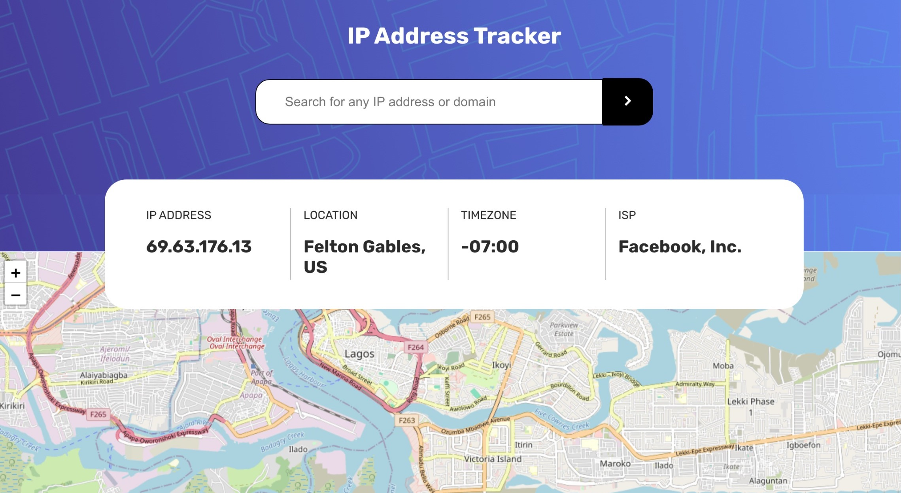

## Overview

### What I built

This is an ip address tracker app where users are able to:

- View the optimal layout for each page depending on their device's screen size
- See hover states for all interactive elements on the page
- See their own IP address on the map on the initial page load
- Search for any IP addresses or domains and see the key information and location

### Screenshot

### Links

- Github URL: (https://https://github.com/Fransco35/ip-address-tracker)
- Live Site URL: (https://ip-address-tracker.vercel.app)

### Built with

- Semantic HTML5 markup
- CSS custom properties
- Desktop-first workflow
- [React](https://reactjs.org/) - JS library
- [IP Geolocation API by IPify](https://geo.ipify.org/)
- [LeafletJS](https://leafletjs.com/).

### Continued development

For continuous development, a live tracking functionality which would work on the move will be something I will like to implement.

## Author

- Website - [@francis inegbenose](https://www.francisinegbenose.vercel.app)
- Github- [@Fransco35](https://github.com/Fransco35)
- Frontend Mentors- [@Fransco35](https://www.frontendmentor.io/profile/Fransco35)
